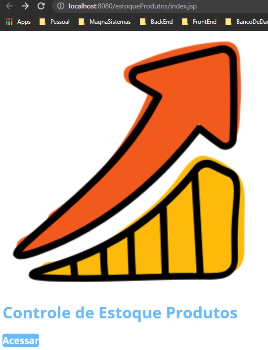
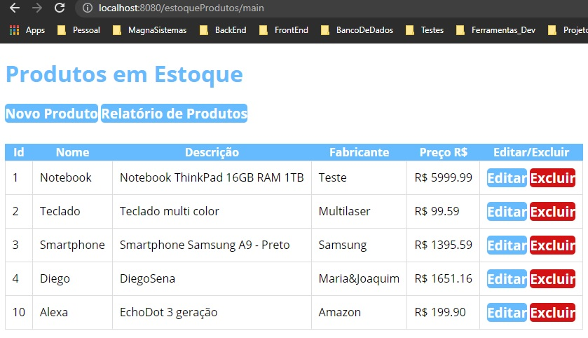
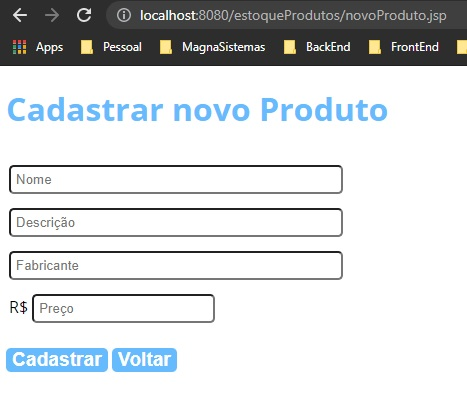
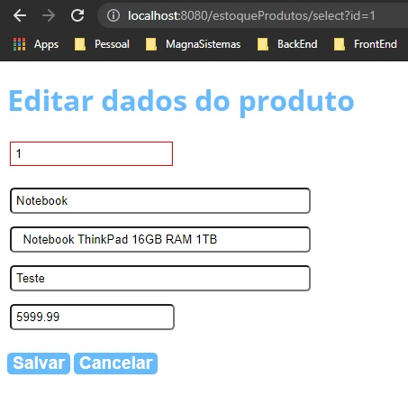


# CRUD JSP  
Projeto de estoque de produtos para fins de estudos, onde foi criada as principais funcionalidades de de uma aplicação real utilizando JSP e arquitetura MVC. 
Para a funcionalidade de exportar relatório em PDF, usado a biblioteca ItextPDF.

## Authors

- [@diegosena7](https://github.com/diegosena7)

  
## Tech Stack

**Tecnologias:** Java, HTML, CSS, Javascript

**Banco de Dados:** MySQL 8.0.20

**Servidor:** Tomcat 9.0.48

**Libs:** mysql-connector-java-8.0.20 e itextpdf-5.5.13.2
  

Tela inicial

Lista de Produtos

Tela de Cadastro de Produto

Tela de Editar dados do Produto

